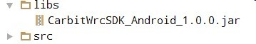

#亿连方控车载版 SDK Android 接入说明

---------------
##目录
[一、简介](#简介)

[二、配置开发环境](#配置开发环境)

[三、SDK接入步骤](#SDK接入步骤)

------------------
<h2 id="简介">一、简介</h2>

亿连方控车载版SDK是一款为第三方应用提供与亿连方控硬件连接的SDK，基于Android车机平台，诚邀各开发者与亿连一起建立车生态。当前版本仅支持Android4.3及以上版本和蓝牙4.0以上的Android车机。

 **Tips：同一时间只能有一个SDK与亿连方控连接。**


<h2 id="配置开发环境">二、配置开发环境</h2>

在Android工程中加入SDK所需的lib文件，以android-studio为例，如下图所示，加入亿连开放平台SDK：



在AndroidManifest.xml文件中加入下面内容：
```java
    <uses-permission android:name="android.permission.BLUETOOTH" />
    <uses-permission android:name="android.permission.BLUETOOTH_ADMIN" />
```
<h2 id="SDK接入步骤">三、SDK接入步骤</h2>

1、 获得SDK实例：

```java
WrcManager wrcManager = WrcManager.getInstance();
```

2、 SDK初始化

```java
wrcManager.init(context, key, pNumber)
```
第一个参数context为上下文，第二个参数为亿连方控授权密钥, 第三个参数为项目编号。

**Tips：确保SDK初始化后才能执行后面的方法。**

3、 检查系统环境是否可用

```java
boolean isWrcSupport = wrcManager.isWrcSupport(context)
```
**Tips：检查Android版本需要4.0以上，蓝牙4.0。系统支持方控返回true，否则返回false**

4、 开始扫描亿连方控

```java
wrcManager.startWrcScan(callback)
```
第一个参数：callback为ScanCallback类型，定义如下：

```java
public interface ScanCallback {
    /**
     * 当发现亿连方控
     *
     * @param device 扫描到的亿连方控设备
     */
    void onWrcScan(final WrcDevice device);
    
    /**
     * 扫描出错时回调
     *
     * @param errorCode 错误码
     */
    void onScanError(int errorCode);
    
    /**
     * 亿连方控UUID过滤器
     * @return
     */
    List<UUID> getUuidFilter();
}
```

**Tips：从CarBitWrcSDK 1.0.18开始，可以通过getUuidFilter()过滤亿连方控设备的UUID，只有getUuidFilter()与申请方控的UUID完全匹配才能扫描到方控并回调到onWrcScan。例如：**

```java
    @Override
    public List<UUID> getUuidFilter() {
        try {
            return Arrays.asList(
                    //请将下面两处xxxxxxxx修改方控对应的UUID，点击搜索设备后可以扫描到方控 确保UUID格式
                    UUID.fromString("00001c00-d102-11e1-9b23-xxxxxxxxxxxx"),
                    UUID.fromString("xxxxxxxx-0000-1000-8000-00805f9b34fb")
            );
        } catch (Exception e) {
            e.printStackTrace();
            Toast.makeText(MainActivity.this, "UUID格式错误", Toast.LENGTH_SHORT).show();
        }
        return null;
    }
```

5、 连接亿连方控

```java
wrcManager.connectWrc(device, callback)
```
第一个参数device为onWrcScan方法扫描到的亿连方控设备，第二个参数callback为WrcCallback类型，定义如下：
```java
public interface WrcCallback {
    /**
     * 亿连方控已连接状态时回调
     * @param device 已连接的亿连方控设备
     */
    void onConnected(final WrcDevice device);

    /**
     * 亿连方控断开时回调
     * @param device 已断开亿连方控设备
     */
    void onDisconnected(final WrcDevice device);

    /**
     * 亿连方控按键回调
     * @param keyCode 详见：KEY_LEFT_UP, KEY_RIGHT_UP, KEY_LEFT_DOWN, KEY_RIGHT_DOWN, KEY_CENTRE
     * @param action  详见：ACTION_SINGLE_CLICK, ACTION_LONG_PRESSED
     */
    void onWrcKeyEvent(short keyCode,short action);
    
    /**
     * 返回亿连方控版本号等信息
     * @param device
     */
    void onCharacteristicRead(WrcDevice device);
        
    /**
     * 连接出错回调
     * @param errorCode
     */
    void onWrcError(int errorCode);
}
```

6、 判断亿连方控是否连接

```java
boolean isConnectWrc =  wrcManager.isConnectWrc();
```


7、 断开亿驾方控连接

```java
wrcManager.disconnect();
```


8、 固件升级(暂时不对持)

```java
wrcManager.startWrcOta(file, callback);
```
第一个参数file是固件升级文件；第二个参数callback为OtaCallback类型，定义如下：

```java
public interface OtaCallback{
    /**
     * 固件升级进度更新回调
     * @param progress   当前进度
     * @param total      总进度
     * @param sentNumber 固件大小(字节)
     */
    void onOtaProgressUpdate(final int progress, final int total, final int sentNumber);

    /**
     * 固件升级出错回调
     * @param errorCode 错误码
     */
    void onOtaError(short errorCode);

    /**
     * 固件升级状态更新回调
     * @param state 详见: OTA_STATE_FAILED, OTA_STATE_COMPLETED, OTA_STATE_INPROGRESS
     */
    void onOtaStateUpdate(short state);
}
```


